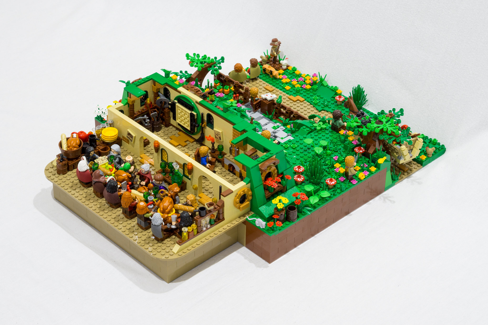

```{r setup, include=FALSE}
options(htmltools.dir.version = FALSE)
library(icon)

footer_gen <- function(text = "community.rstudio.com", footer_class = "my-footer") {
  glue::glue('<div class="{footer_class}"><span>{text}</span></div>')
}
```

layout: true

`r footer_gen()` 

<!-- this adds the link footer to all slides, depends on my-footer class in css-->

---
name: xaringan-title
class: inverse, left, top
background-image: url(img/background-title-with-logo.png)
background-size: cover

.center[
.titleheaderfont[
.titleheader[
Shiny Developer Series
]
]
]

## Episode 1: Development of Shiny
## Past and Future
### Special Guest: Winston Chang

---

# `shinydevseries::guest_info()`

.pull-left[

.large[
Winston Chang is a software engineer at RStudio, and is a developer for the Shiny, ggplot2, and devtools packages. He holds a Ph.D. in psychology from Northwestern University and is the author of the R Graphics Cookbook, published by O’Reilly Media.

`r icon::fa("twitter")` [winston_chang](https://twitter.com/winston_chang)
<br>
`r icon::fa("github")` [wch](https://github.com/wch)
]
]

.pull-right[


]

---
class: inverse, center, top
background-image: url(img/bridge_picture.jpg)
background-size: cover

# Journey to Production

---
class: center, top

# Design Principles

.pull-left[

]

.pull-right[

]

---
class: inverse, center, top
background-image: url(img/horizon.jpg)
background-size: cover

# Looking Ahead

---
class: inverse, center, top
background-image: url(img/audience.png)
background-size: contain

# Questions?

---

# Stay Tuned!

Keep watching [community.rstudio.com](https://community.rstudio.com) for the next __Shiny Developer Series__ webinars

Recording of webinars along with additional content will be posted on [shinydevseries.com](https://shinydevseries.com)

.center[

]
