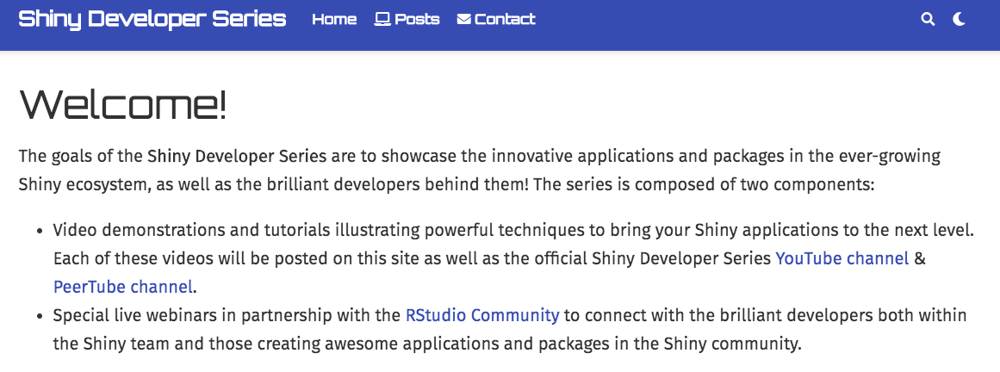

```{r setup, include=FALSE}
options(htmltools.dir.version = FALSE)
library(icon)

footer_gen <- function(text = "community.rstudio.com", footer_class = "my-footer") {
  glue::glue('<div class="{footer_class}"><span>{text}</span></div>')
}
```

layout: true

`r footer_gen()` 

<!-- this adds the link footer to all slides, depends on my-footer class in css-->

---
name: xaringan-title
class: inverse, left, top
background-image: url(img/background-title-with-logo.png)
background-size: cover

.center[
.titleheaderfont[
.titleheader[
Shiny Developer Series
]
]
]

## Episode 2: `{golem}` and Effective
## Shiny Development Methods
### Special Guest: Colin Fay

---

# `shinydevseries::guest_info()`

.pull-left[

.large[
Colin Fay is a data scientist & R hacker at ThinkR, an organization that offers tailor-made R training and consultancy for R projects.  Colin has developed numerous R packages related to Shiny and beyond, as well as authoring the [Building Big Shiny Apps - A Workflow](https://thinkr-open.github.io/building-shiny-apps-workflow/) online book.

`r icon::fa("twitter")` [_ColinFay](https://twitter.com/_ColinFay)
<br>
`r icon::fa("github")` [ColinFay](https://github.com/ColinFay)
]
]

.pull-right[


]

---
class: inverse, center, top
background-image: url(img/golem.png)
background-size: contain

# Uncovering Golem

---
class: center, top
background-size: contain
background-image: url(img/)

# Setting up for Success


---
class: center, top
background-image: url(img/perspective.jpg)
background-size: cover

# Another Perspective

---
class: inverse, center, top
background-image: url(img/audience.png)
background-size: contain

# Questions?

---

# Stay Tuned!

Visit [pages.rstudio.net/shiny_dev_series.html](https://pages.rstudio.net/shiny_dev_series.html) for the complete schedule and to sign up for future webinars!

Recording of webinars along with additional content will be posted on [shinydevseries.com](https://shinydevseries.com)

.center[

]
